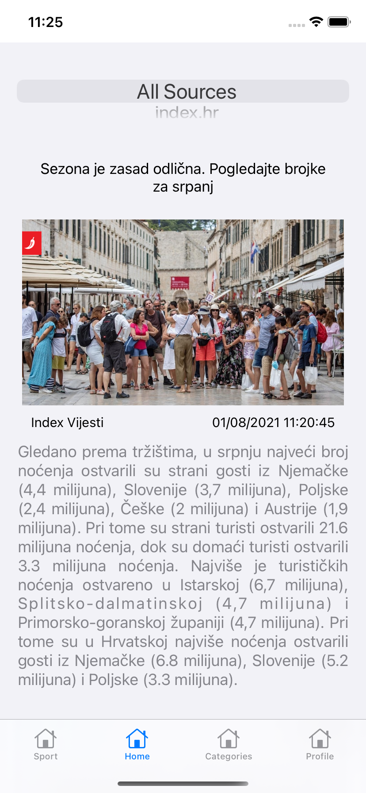
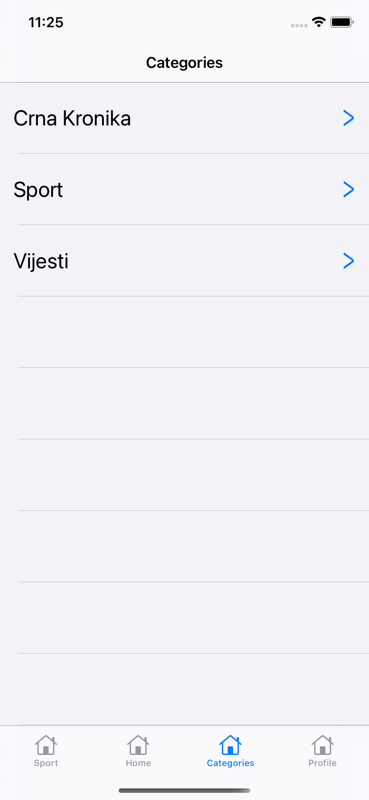

# iOSQuickRead
QuickRead iOS application

In the sea of news that we see on portals every day, it's easy to spend a lot of time reading long articles. To change that, I decided to create an app for quickly reading most important parts of the articles. This app shows articles from different sources. User can choose source and category and read summarized versions of the articles. User can also go to the whole article on the original website.  
On this project, article scrapper is used (more about it here: https://github.com/dinoMartan/QuickReadScrapper)  
Backend part of this project was made by Ivan Beljan (https://github.com/IvanB475/QuickreadBackend, https://github.com/IvanB475/AuthService).

Testing credentials:  
username: testtest  
password: 123456  

 

  
  
  
  

